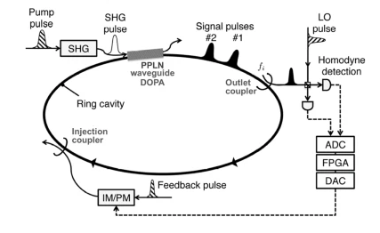

# Figure Patterns for Inline Schematics

Reference for building SVG schematics with LaTeX/KaTeX equations inside
the quantum-notes pages. Pages load KaTeX from CDN and run an
auto-render script (`KATEX_INIT_SCRIPT` in `_build.py`) that walks the
DOM looking for `\(...\)` (inline) and `\[...\]` (display) delimiters.
KaTeX cannot render directly into SVG — it produces HTML+CSS — so any
figure that mixes diagram geometry with typeset equations needs to
choose how the two media meet.

Three patterns are in use across the seven notes. They differ in how
they handle the SVG/HTML boundary.

---

## Pattern A — Pure SVG, Unicode math only

**When**: Schematic with no math beyond what Unicode covers (Greek
letters, simple super/subscripts, common operators).

**How**: Standard SVG with `<text>` elements containing Unicode
glyphs: `χ⁽²⁾`, `η`, `γ`, `Σⱼ`, `e⁻ᵞᵗ`, `α`, `Δk`, `√κ`, `½`.
KaTeX is not invoked anywhere inside the figure.

**Skeleton**:
```html
<figure style="margin: 1rem 0;">
  <svg viewBox="0 0 720 360"
       xmlns="http://www.w3.org/2000/svg"
       style="width:100%;max-width:720px;display:block;
              background:var(--page-bg);
              border:1px solid var(--page-rule);
              border-radius:6px;">
    <text x="100" y="30" font-size="11" fill="#7a9fd1">η = 0.95</text>
    <text x="100" y="50" font-size="11" fill="#888">Σ = ½A⁻¹</text>
    <!-- shapes, arrows, labels ... -->
  </svg>
  <figcaption style="font-size: 0.85rem;
                     color: var(--page-muted);
                     margin-top: 0.4rem;
                     text-align: center;">
    <strong>Fig.&nbsp;X.</strong> ...
  </figcaption>
</figure>
```

**Pros**: Smallest, simplest, most robust. SVG scales fluidly; nothing
to mis-align. Works at any resolution and on screen-readers as plain
text.

**Cons**: Can't render genuine LaTeX. Anything beyond
`α β γ ⁰¹²³⁴⁵⁶⁷⁸⁹ ₀₁₂₃₄ √ ∑ ∫ ½ ⅓ ⅔` looks awkward. No fractions,
matrices, integrals with limits, `\bigl` brackets, etc.

**Used in**: Fig. 2 right side of `07_thermodynamic_la_ou_machine.html`
(matrix-encoding diagram); the schematics inside §three-machines
discussion that the table replaced.

---

## Pattern B — SVG with `<foreignObject>` + KaTeX (avoid)

**When**: Tempting whenever you want LaTeX *inside* SVG coordinates.
**Don't.** Listed here so future-you knows why we removed it.

**How**: Wrap KaTeX-bearing HTML in `<foreignObject>` so the browser
treats the rectangle as embedded HTML:
```xml
<foreignObject x="10" y="292" width="340" height="105">
  <div xmlns="http://www.w3.org/1999/xhtml" style="font-size:11px;">
    \(x \leftarrow x - dt\,A x + \sqrt{dt}\,D^{1/2}\,\xi\)
  </div>
</foreignObject>
```
KaTeX picks up the `\(...\)` delimiters during the auto-render walk.

**Why it fails**: SVG content scales as a single unit when the SVG is
made wider than its `viewBox` (e.g., when sidebars are hidden and the
figure expands). Stroke widths, geometry, and SVG `<text>` font sizes
all scale together. But `<foreignObject>` HTML *does not scale the
same way* — the browser treats it as nominal-pixel HTML at fixed font
size, which then drifts relative to the surrounding SVG. Equation
boxes either overflow their bounding rect, clip, or float off-center.
On Safari and on small zoom levels the breakage is worse.

**Used in**: an earlier version of Fig. 1 in
`07_thermodynamic_la_ou_machine.html`. Removed in favour of Pattern C.

---

## Pattern C — HTML+SVG hybrid (recommended for math-heavy figures)

**When**: The figure has multiple equations, especially anything that
needs fractions, matrices, integrals, or `\bigl[\cdot\bigr]`.

**How**: An outer `<figure>` containing a CSS grid (or flex) of cells.
Each cell stacks: optional title (HTML) → schematic SVG (geometry
only, no math) → HTML caption block with KaTeX `\(...\)`.

**Skeleton** (two-column comparison, as in Fig. 1):
```html
<figure style="margin: 1rem 0;">
  <div style="display: grid;
              grid-template-columns: 1fr 1fr;
              gap: 1rem;
              align-items: start;
              background: var(--page-bg);
              border: 1px solid var(--page-rule);
              border-radius: 6px;
              padding: 1rem;">
    <!-- LEFT column -->
    <div>
      <div style="font-weight: 600;
                  color: #7a9fd1;
                  text-align: center;
                  margin-bottom: 0.4rem;">
        Title A
      </div>
      <svg viewBox="0 0 340 250"
           xmlns="http://www.w3.org/2000/svg"
           style="width:100%;height:auto;display:block;">
        <!-- geometry only; no math text -->
      </svg>
      <div style="background: rgba(122,159,209,0.10);
                  border: 1px solid #7a9fd1;
                  border-radius: 4px;
                  padding: 0.55rem 0.75rem;
                  margin-top: 0.55rem;
                  font-size: 0.88rem;">
        <div style="color: #7a9fd1; font-weight: 600;">Update</div>
        <p>\(x \leftarrow x + dt\bigl[(r-1)x - \mu x^{3}\bigr] + \varepsilon J x\)</p>
      </div>
    </div>
    <!-- RIGHT column: same skeleton, different content -->
    <div>...</div>
  </div>
  <figcaption>...</figcaption>
</figure>
```

**Skeleton** (one-column with a sidebar of math, as in Fig. 3):
```html
<div style="display: grid;
            grid-template-columns: minmax(180px, 240px) 1fr;
            gap: 1rem;
            align-items: stretch;">
  <div style="display: flex; align-items: center;">
    <svg viewBox="0 0 240 280">…geometry only…</svg>
  </div>
  <div style="display: grid; gap: 0.5rem;">
    <div style="border: 1px solid #7a9fd1; padding: 0.6rem;">
      <div style="color: #7a9fd1; font-weight: 600;">Mode 1</div>
      <p>\(v_i = \langle x_i \rangle \Rightarrow v = A^{-1} b\)</p>
    </div>
    <!-- more mode boxes -->
  </div>
</div>
```

**Pros**: KaTeX renders into normal HTML and is fully styleable; SVG
handles only what SVG is good at (lines, ellipses, arrows). Both scale
correctly under all viewport widths. Works in dark mode without
special handling because all colors flow from CSS variables.

**Cons**: A little more verbose than the foreignObject version. Loses
the ability to position equations in absolute SVG coordinates (which
is a feature, not a bug — see why Pattern B fails).

**Used in**: Fig. 1 (architectural comparison) and Fig. 3 (readout
modes) of `07_thermodynamic_la_ou_machine.html`. Recommended default
for any new figure with non-trivial math.

---

## Cross-cutting conventions

### SVG sizing

```html
<svg viewBox="0 0 W H"
     xmlns="http://www.w3.org/2000/svg"
     style="width:100%; height:auto; display:block;">
```

Width is fluid (always 100% of parent). Height auto-scales by the
viewBox aspect ratio. Avoid `max-width` on the SVG itself for
hybrid figures — let the parent grid cell control width. (For pure
Pattern A figures, a `max-width: 720px` on the SVG is fine; the
`body.sidebars-collapsed figure > svg { max-width: 100% !important }`
rule in `_build.py` lifts the cap when sidebars are hidden so the
figure can grow.)

### `<defs><marker>` id collisions

Each `<marker>` `id` is global to the document. Two SVGs both
declaring `<marker id="arr">` will silently share the *first*
declaration, including its `fill` color — which means the second
SVG's arrows render in the first SVG's color. Always namespace
markers per figure: `arr-cim`, `arr-ou`, `arr-encoding`, `arr3`, etc.
This bit Fig. 1 once when the original markers were just `arr` /
`arr2`.

### Color tokens

Use the same palette as the surrounding page:
- `var(--page-bg)`, `var(--page-rule)`, `var(--page-muted)`,
  `var(--page-accent)` for chrome.
- Per-machine accents (used consistently across notes 06–07):
  - `#7a9fd1` (blue): MFB-CIM
  - `#79c79f` (green): overdamped OU machine
  - `#e8b96a` (yellow/amber): off-diagonal coupling, FPGA path,
    Direction-A underdamped
  - `#c879d1` (magenta): noise, χ⁽²⁾ medium, log-det / cumulative work
- Backgrounds for HTML callout boxes inside figures use the accent
  at 10–18 % alpha, e.g. `rgba(122,159,209,0.10)`.

### KaTeX delimiters

- `\(...\)` — inline math
- `\[...\]` — display math
- `$$...$$` — display math (also accepted by `KATEX_INIT_SCRIPT`)

Inside Python r-strings (`_build.py`), backslashes are literal so
`\(...\)` works as written. Outside r-strings, escape: `\\(...\\)`.

### Lifting figure max-width when sidebars are hidden

The build script appends:
```css
body.sidebars-collapsed figure > svg,
body.sidebars-collapsed figure > div,
body.sidebars-collapsed figure > img,
body.sidebars-collapsed figure > picture {
  max-width: 100% !important;
}
```
which means a Pattern A SVG with inline `style="max-width: 720px"`
will grow to fill the wider main column when the user toggles
sidebars off. No per-figure work needed.

### When to import a PDF/PNG instead

For figures that are already rendered (paper figures, photos, complex
diagrams from drawing tools), drop the source file in `_lectures/` and
reference it:
```html
<figure>
  
  <figcaption>...</figcaption>
</figure>
```
Don't reproduce existing diagrams from scratch in SVG — link to the
source. (The same `body.sidebars-collapsed` rule lifts the cap on
images.)

---

## Decision tree

```
Does the figure need fractions, matrices, integrals, or \bigl?
├── No  → Pattern A (pure SVG + Unicode)
└── Yes → Pattern C (HTML+SVG hybrid grid)

Tempted to use Pattern B (SVG <foreignObject>)?
└── Don't.
```

## Concrete examples in the repo

- `07_thermodynamic_la_ou_machine.html` Fig. 1 — Pattern C, two-column
  comparison with per-column equation block.
- `07_thermodynamic_la_ou_machine.html` Fig. 2 — Pattern A, matrix
  encoding map. Right side has Unicode-only labels; left side uses
  small SVG matrices.
- `07_thermodynamic_la_ou_machine.html` Fig. 3 — Pattern C,
  schematic-on-left with mode-box stack on the right.
- Tab. 1 (§three-machines) — pure HTML table; not a figure but
  follows the same color tokens and KaTeX delimiter conventions.
